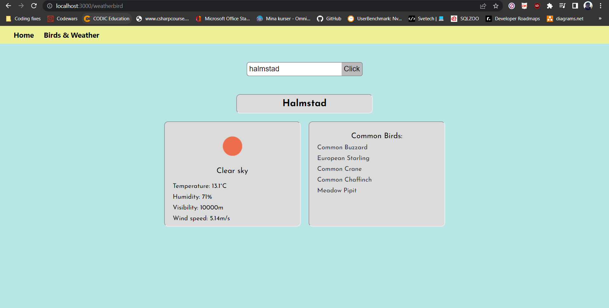

#### Sebastian Gustafsson

#### Herman Brunberg

# React Project

The website contains a homepage with information about the app (lorem ipsum), as well as a page containing the application to fetch weather and bird data.

The birdwatching weather app use the "OpenWeather" and "eBird" APIs. With the app a user can type in the name of a region (city, county, country) and get the weather data as well as the top five most common birds in the area.

